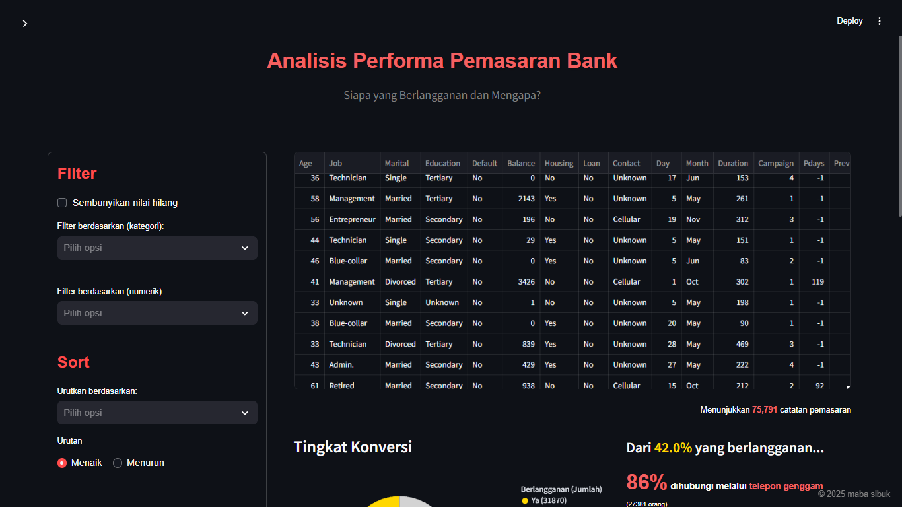
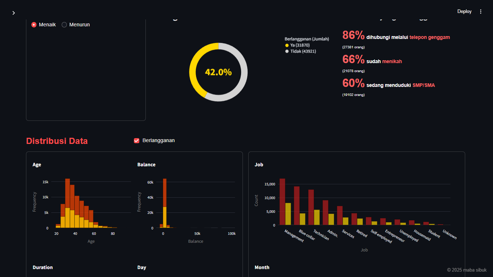
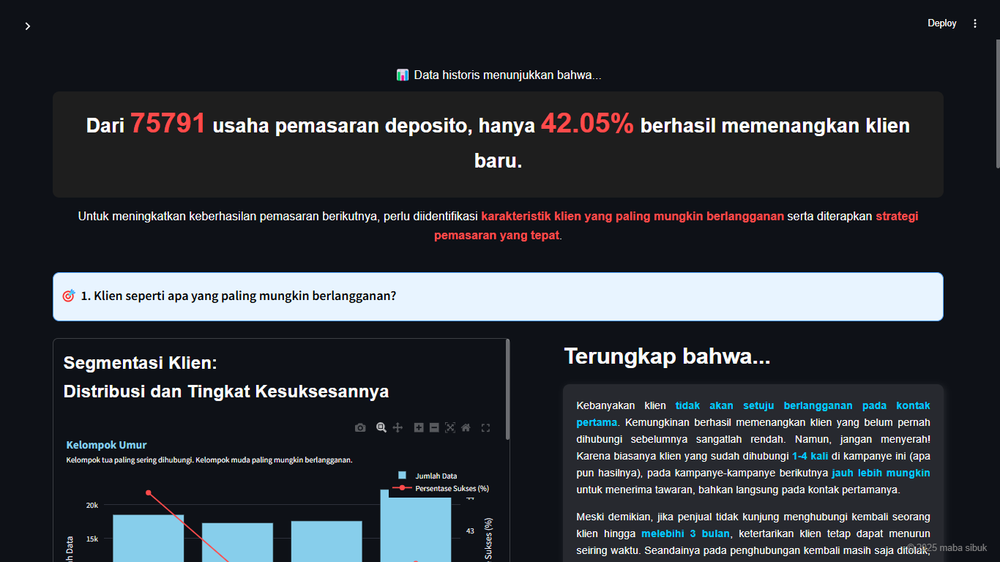
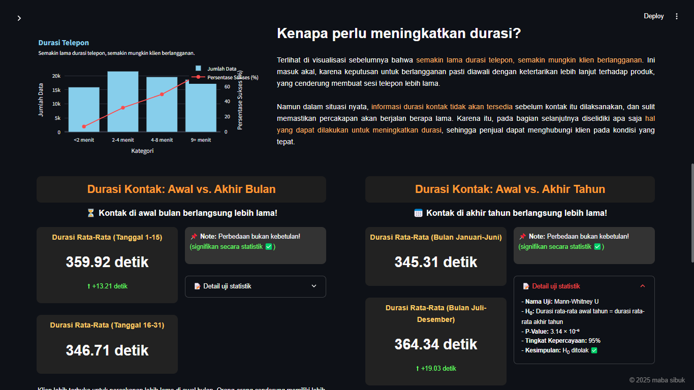

# 📊 Bank Marketing Performance Dashboard  

An interactive **Streamlit** dashboard for analyzing bank marketing campaign data. This app provides **data visualizations, filtering options, and predictive modeling** to explore customer subscription behavior.

## 🚀 Features  
✅ Interactive **filters** for categorical & numerical variables  
✅ **Data visualizations and analysis** (charts, tables, statistics)  
✅ **Predictive modeling** for campaign performance  

## 📂 Dataset  
The dataset contains historical records of direct marketing campaigns of a Portuguese banking institution from May 2008 to November 2010. The product offered were term deposits and the marketing campaigns were based on phone calls.  

The full dataset was described and analyzed in:  
S. Moro, R. Laureano and P. Cortez. Using Data Mining for Bank Direct Marketing: An Application of the CRISP-DM Methodology.  
In P. Novais et al. (Eds.), Proceedings of the European Simulation and Modelling Conference - ESM'2011, pp. 117-121, Guimarães,  
Portugal, October, 2011. EUROSIS.
More details about the dataset and its variables can be found [here](https://pastebin.com/B6b8qRgB)

## ⚙️ Installation
### 1️⃣ Clone this repository:
```bash
git clone https://github.com/dalrn/bank-marketing-dashboard.git
cd bank-marketing-dashboard
```

### 2️⃣ Install dependencies:
```bash
pip install -r requirements.txt
```

### 3️⃣ Run the Streamlit app:
```bash
streamlit run dashboard.py
```

## 🖼 Screenshots







## 👥 Contributors

- [@sahdahx](https://github.com/sahdahx)
- [@tiazara](https://github.com/tiazara)
